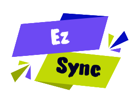

# ⚡ EzSync — Real-Time Collaborative Code & Image Editor

<p align="center">
  
</p>

<p align="center">
  
  
  
  
  
  
</p>

---

## 📖 Overview

**EzSync** is a high-performance, zero-dependency, real-time collaborative code editor and image sharing platform built for developers, educators, tech interviewers, and engineering teams. 

Unlike heavy collaborative platforms that require account creation, logins, or complex database setups, **EzSync** works instantly out of the box. Simply type a room name or share a custom URL (e.g. `ezsync-editor.onrender.com/aditya`), and multiple developers can code, share images, format code, and debug together in real time across any browser, device, or incognito session.

---

## ✨ Features & Highlights

### ⚡ Real-Time Synchronization Engine
- **Ultra-Fast Polling Architecture**: Syncs code edits within **~300ms** across all connected clients.
- **Cross-Profile & Incognito Sync**: Works seamlessly between normal browser tabs, private/incognito windows, mobile devices, and desktop browsers.
- **Zero Echo Conflicts**: Smart version tracking (`myPostedVersion` & `knownVersion`) prevents remote cursor jumping and keystroke overwrites.
- **BroadcastChannel Integration**: Zero-latency local synchronization for tabs running within the same browser profile.

### 🔗 Clean & Human-Readable URLs
- **Custom Room Names**: Access any session using clean paths like `https://ezsync-editor.onrender.com/aditya` or `https://ezsync-editor.onrender.com/team-alpha`.
- **Short 5-Char Auto IDs**: Generates clean, concise random session IDs (e.g. `/x7k9q`) when no custom name is specified.
- **One-Click Share Button**: Instant URL copying directly to clipboard from the editor header.

### 📁 Universal Code & File Upload
- **Drag & Drop Workspace**: Drop any code file or document directly into the editor wrapper.
- **Broad File Extension Support**:
  - **JavaScript / Web**: `.js`, `.jsx`, `.ts`, `.tsx`, `.vue`, `.svelte`, `.html`, `.css`, `.scss`, `.json`
  - **Backend & Systems**: `.py`, `.java`, `.jsp`, `.c`, `.cpp`, `.cs`, `.php`, `.rb`, `.go`, `.rs`, `.swift`, `.kt`
  - **DevOps & Config**: `Dockerfile`, `.env`, `.toml`, `.yaml`, `.yml`, `.sql`, `.sh`, `.ps1`, `.bat`
  - **Markup & Specs**: `.md`, `.xml`, `.svg`, `.graphql`, `.txt`
- **Automatic Language Detection**: Auto-detects programming language from file extensions and switches syntax highlighting instantly.

### 🖼️ Real-Time Image Upload & Live Preview Modal
- **Drag & Drop Image Upload**: Supports `.png`, `.jpg`, `.jpeg`, `.gif`, `.webp`, `.ico`, and `.bmp` files (up to 10MB).
- **Base64 Synchronization**: Automatically encodes images into Base64 Data URIs and broadcasts them to all peers in the room.
- **Interactive Image Viewer**: Dynamically highlights a **`🖼️ View Image`** toolbar button when an image is present in the session.
- **Image Metadata & Download**: Preview images in high-res with width/height dimension display, **Copy Data URL**, and one-click image download.

### 🎨 50+ Languages & 4 Premium Editor Themes
- **Syntax Highlighting**: Full CodeMirror 5 language support for 50+ programming languages.
- **4 Curated Themes**:
  - 🌑 **Dracula** (Default Dark)
  - 🎨 **Monokai**
  - 🧊 **Nord**
  - 🌤️ **GitHub Light**

### ✨ Productivity Tools & Code Formatting
- **One-Click Beautifier**: Formats JSON, JS, TS, HTML, XML, and CSS code cleanly on demand.
- **Code Downloader**: Saves current session code as a standalone file with auto-detected file extensions.
- **Read-Only Lock Mode**: Locks the editor (`🔒`) to prevent accidental edits during presentations or code reviews.
- **Live Collaborator Bubbles**: Color-coded peer avatar bubbles indicating active room participants and typing indicators (`Alice is typing…`).

---

## ⌨️ Keyboard Shortcuts

| Shortcut | Action |
|---|---|
| <kbd>Ctrl</kbd> + <kbd>S</kbd> | Manual Save & Broadcast |
| <kbd>Ctrl</kbd> + <kbd>/</kbd> | Toggle Line Comment |
| <kbd>Ctrl</kbd> + <kbd>F</kbd> | Find / Search in Code |
| <kbd>Ctrl</kbd> + <kbd>Shift</kbd> + <kbd>F</kbd> | Auto Beautify & Format Code |
| <kbd>Ctrl</kbd> + <kbd>Shift</kbd> + <kbd>P</kbd> | Toggle Read-Only Lock Mode |
| <kbd>Ctrl</kbd> + <kbd>Shift</kbd> + <kbd>K</kbd> | Clear All Code in Session |
| <kbd>Esc</kbd> | Close Any Open Modal |

---

## 🛠️ Technology Stack & Architecture

```
                       ┌──────────────────────────────────────────┐
                       │           Browser Clients (A & B)        │
                       │  (Monospace UI + CodeMirror 5 Engine)    │
                       └───────────────────┬──────────────────────┘
                                           │
                        POST /sync/<room>  │  GET /poll/<room>
                        (Push Code Edits)  │  (Fetch Version State)
                                           ▼
                       ┌──────────────────────────────────────────┐
                       │          EzSync Threaded Server          │
                       │   Pure Python 3 Stdlib (server.py)       │
                       │  ThreadedHTTPServer + Dynamic Routing     │
                       └──────────────────────────────────────────┘
```

| Component | Technology Used |
|---|---|
| **Frontend Structure** | HTML5, Semantic Elements |
| **Styling & UI** | Vanilla CSS3 (Custom Dark Obsidian Design System) |
| **Typography** | `JetBrains Mono`, `Fira Code`, `SF Mono`, `Consolas` |
| **Code Editor Engine** | CodeMirror 5 (with folding, match brackets, active line) |
| **Backend Web Server** | Pure Python 3 Standard Library (`HTTPServer`, `SimpleHTTPRequestHandler`, `threading`) |
| **Sync Protocol** | HTTP REST (POST sync / GET poll) + BroadcastChannel API |
| **External Dependencies** | **NONE (0 NPM packages, 0 Python PyPI packages)** |

---

## 📡 API Endpoints Reference

The backend `server.py` exposes the following lightweight endpoints:

### `GET /ping`
- **Description**: Server health check and room count metric.
- **Response**: `{"status": "ok", "rooms": 3}`

### `GET /poll/<roomId>`
- **Description**: Returns current room version, code content, language, and author info.
- **Response**:
```json
{
  "code": "console.log('Hello World');",
  "lang": "javascript",
  "peerId": "x7k9q",
  "name": "Alice",
  "color": "#4f8ef7",
  "version": 14,
  "ts": 1785240424161
}
```

### `POST /sync/<roomId>`
- **Description**: Pushes new code edits for a specific room.
- **Request Body**: `{"code": "...", "lang": "javascript", "peerId": "...", "name": "...", "color": "..."}`
- **Response**: `{"ok": true, "version": 15}`

### `GET /<roomId>`
- **Description**: Clean path routing — routes any room path (e.g. `/aditya`) to serve `editor.html`.

---

## 💻 Local Installation & Setup

No dependencies to install! Run directly with your installed Python 3 interpreter:

```bash
# 1. Clone the repository
git clone https://github.com/Aditya5576/EzSync.git

# 2. Change directory
cd EzSync

# 3. Start the server (No pip install or npm install required!)
python server.py
```

Open **`http://localhost:3000`** in your browser to launch the landing page, or go directly to **`http://localhost:3000/my-room`**.

---

## ☁️ Deployment

Pre-configured for instant 1-click cloud deployment on **Render**, **Koyeb**, **Railway**, or **Heroku**:

- **Render**: Includes `render.yaml` for automatic zero-configuration builds.
- **Procfile**: Declares `web: python server.py` process.
- **Dynamic Port**: Binds to `os.environ.get('PORT', 3000)`.

---

## 📜 License

Distributed under the **MIT License**. See `LICENSE` for more information.

---

<p align="center">
  Built with ❤️ for developers worldwide by <strong>Aditya</strong>
</p>
